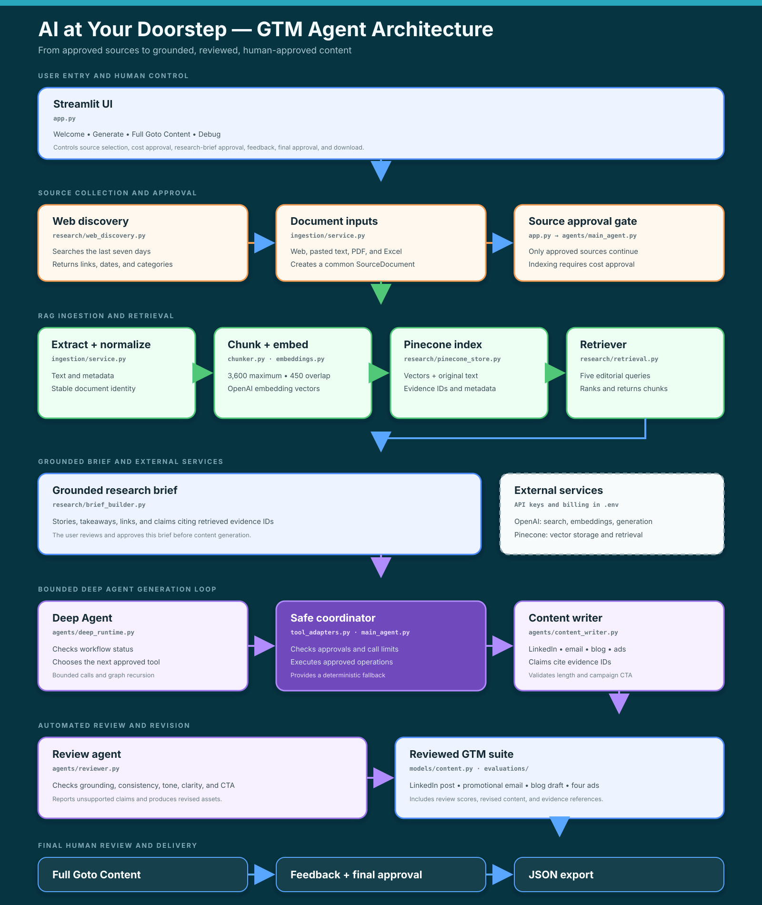

# AI at Your Doorstep

AI at Your Doorstep is a human-approved GTM agent that discovers current AI news,
indexes approved sources in Pinecone, retrieves grounded evidence with RAG, and
produces LinkedIn, email, blog, and ad content.



A Deep Agent coordinates content generation and automated review. Humans retain
control of source selection, API spending, research-brief approval, feedback, final
approval, export, and publishing.

## Workflow

```text
Discover current AI stories or events
                ↓
Human approves trusted sources
                ↓
Extract, chunk, embed, and index in Pinecone
                ↓
Retrieve evidence and generate a grounded research brief
                ↓
Human approves the brief and combined API estimate
                ↓
Deep Agent coordinates content generation and review
                ↓
Human provides feedback and approves the final suite
                ↓
Download JSON for manual editing or publishing
```

The application never publishes content automatically.

## Technology

- Python 3.11+
- Streamlit
- OpenAI Responses API and embeddings
- Deep Agents and LangChain OpenAI
- Pinecone vector database
- Pydantic structured outputs
- PDF and Excel ingestion

## Local setup

```bash
python3.11 -m venv .venv
source .venv/bin/activate
pip install -r requirements-agent.txt
cp .env.example .env
```

Add your OpenAI and Pinecone keys to `.env`, then start the app:

```bash
streamlit run app.py
```

Streamlit prints the local URL in the terminal. It may use port `8502` when `8501`
is occupied. Never commit `.env` or paste API keys into source files, screenshots,
fixtures, or support messages.

## Configuration

| Variable | Purpose |
|---|---|
| `OPENAI_API_KEY` | Bills discovery, generation, review, and embedding calls |
| `OPENAI_MODEL` | Model used for discovery, briefs, content, review, and orchestration |
| `OPENAI_EMBEDDING_MODEL` | Embedding model used for Pinecone vectors |
| `OPENAI_EMBEDDING_DIMENSIONS` | Must match the Pinecone index dimension |
| `CHUNK_MAX_CHARACTERS` | Maximum chunk size; defaults to the evaluated value of 3600 |
| `CHUNK_OVERLAP_CHARACTERS` | Word-aligned overlap; defaults to the evaluated value of 450 |
| `PINECONE_API_KEY` | Authenticates Pinecone operations |
| `PINECONE_INDEX_NAME` | Target Pinecone index |
| `PINECONE_NAMESPACE` | Isolates this application's vectors |
| `OPENAI_AGENT_MAX_MODEL_CALLS` | Hard limit on orchestration model calls per run |
| `OPENAI_AGENT_RECURSION_LIMIT` | Internal Deep Agent graph-step allowance |
| `EVALUATION_RUNS_PATH` | Local directory for approved evaluation bundles |

Cost values in `.env.example` are application estimates, not provider-enforced prices
or dollar caps. Confirm current provider pricing before production use.

## Documentation

- [User guide](docs/USER_GUIDE.md)
- [Architecture](docs/ARCHITECTURE.md)
- [Evaluations](docs/EVALUATIONS.md)
- [Corpus-tied chunking design](docs/CHUNKING_DESIGN.md)

## Tests and evaluations

```bash
python -m unittest discover -s tests
python scripts/evaluate_content_suite.py data/evals/first_successful_run.json
python scripts/evaluate_content_suite.py data/evals/intentionally_flawed_run.json
python scripts/evaluate_retrieval.py --index-corpus --top-k 5
```

The golden fixture must pass; the deliberately flawed fixture must fail.

## Current limitations

- No automatic publishing or social/email platform integration
- No user authentication or multi-tenant data separation
- No newsletter delivery or subscriber-management service
- Cost estimates depend on manually configured rates
- Evidence-ID validation proves reference integrity, not semantic entailment
- Agent orchestration can use a deterministic fallback when it skips a required step
