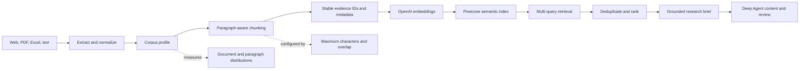

# Architecture

## System flow

```text
Streamlit UI
  ├─ Web discovery (OpenAI web search)
  ├─ Human source approval
  ├─ Web/PDF/Excel ingestion
  ├─ OpenAI embeddings
  ├─ Pinecone indexing and multi-query retrieval
  ├─ Structured research-brief builder
  ├─ Human brief and cost approval
  ├─ Deep Agent coordinator
  │    ├─ Approval-aware content-generation tool
  │    └─ Approval-aware review tool
  ├─ Deterministic validation and fallback
  ├─ Human feedback and final approval
  └─ JSON export and local evaluation-bundle storage
```

## Ingestion and retrieval pipeline



The current system has one semantic retrieval branch. A lexical/BM25 branch has not
been implemented. See [CHUNKING_DESIGN.md](CHUNKING_DESIGN.md) for boundaries,
profiling, and parameter-selection criteria.

## Components

| Module | Responsibility |
|---|---|
| `app.py` | UI, session state, approvals, and cost gates |
| `agents/main_agent.py` | Central deterministic coordinator interface |
| `agents/deep_runtime.py` | Deep Agents graph, skills, and model-call limit |
| `agents/tool_adapters.py` | Approval-aware tools and skipped-step fallback |
| `agents/content_writer.py` | Structured content generation and validation |
| `agents/reviewer.py` | Structured critique, revision, and validation |
| `research/web_discovery.py` | Time-bounded web discovery |
| `research/workflow.py` | Approved ingestion, retrieval, and brief coordination |
| `research/retrieval.py` | Multi-query Pinecone retrieval and deduplication |
| `research/brief_builder.py` | Evidence-grounded structured research brief |
| `research/pinecone_store.py` | Index validation, upsert, query, and filters |
| `ingestion/` | Web, PDF, Excel, text parsing, and chunking |
| `evaluations/` | Offline content and bundle checks |
| `scripts/profile_chunking.py` | Corpus profiling across chunk configurations |

## Grounding model

Every indexed passage receives a stable evidence chunk ID. Brief claims cite those
IDs, and generated assets carry structured `claims_used` records. Validation rejects
unknown IDs at the brief, generation, and review boundaries.

This establishes referential grounding. Proving that every passage semantically
entails every generated claim requires a separate semantic evaluation.

## Agent safety boundaries

The Deep Agent does not control source approval, Pinecone indexing, research-brief
approval, API-cost approval, final approval, or publishing.

Paid generation and review tools are single-use per run. Middleware enforces the
orchestration model-call limit. The separate recursion limit allows internal planning,
skill reads, and tool transitions.

## Data storage

- Pinecone stores vectors, evidence text, and source metadata in one namespace.
- Streamlit session state holds the active run.
- Approved evaluation bundles are written atomically under `data/evals/runs/`.
- `.env` and runtime evaluation bundles are excluded from version control.
